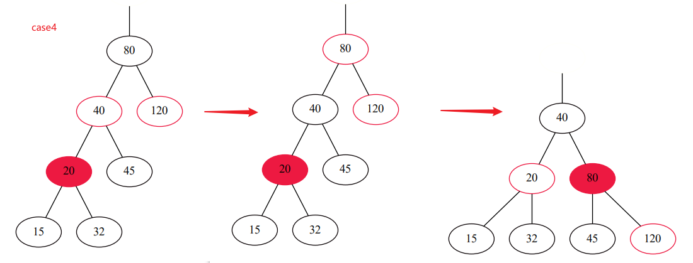

# 红黑树
[Toc]
红黑树是一种特殊的二叉搜索树，按照插入或者删除元素时通过左旋或者右旋来使树始终保持平衡；

## 1.红黑树特征

1. 每个节点不是红色就是黑色
2. 根节点是黑色
3. 叶子节点也是黑色（空的叶子节点）
4. 红色节点在子节点必须是黑色
5. 从一个节点到其子孙节点走过相同的黑色节点

先来看下`TreeNode `的定义：

一般的，对于二叉树的每个节点，要定义左右子节点跟value值，父节点，红黑树需要额外的记录当前节点的color

```java
public class RBTree<T extends Comparable<T>> {
    private RBNode<T> root; // 树的根节点

    public class RBNode<T extends Comparable<T>> {
        boolean red; // 红色为true,黑色false
        T key; // 关键字(键值)
        RBNode<T> left; // 左子节点
        RBNode<T> right; // 右子节点
        RBNode<T> parent; // 父节点

        public RBNode(T key, boolean red, RBNode<T> parent, RBNode<T> left, RBNode<T> right) {
            this.key = key;
            this.red = red;
            this.parent = parent;
            this.left = left;
            this.right = right;
        }
    }

}
```

## 2.左旋

左旋实际就是将当前节点放在它的左子节点上


看起来很简单，下面考虑下如何用`JAVA`代码实现，主要考虑，如果有节点为空怎么办?如果X为根节点怎么办？


```java
// 左旋操作
private void leftRotate(RBNode<T> x) {
    RBNode<T> y = x.right;
    // 将y左节点作为x的右节点
    x.right = y.left;
    if (y.left != null) {
        y.left.parent = x;
    }

    // 用y替掉x，如果x是根节点，维护y为根节点
    y.parent = x.parent;
    if (x.parent == null) {
        this.root = y;
    } else {
        if (x.parent.left == x) {
            x.parent.left = y;
        } else {
            x.parent.right = y;
        }
    }

    // 将 x设为y的左子节点
    y.left = x;
    x.parent = y;
}
```

## 右旋

看了左旋以后其实很容易写出右旋，因为本质上左旋右旋是互逆的过程


```java
// 右旋操作
private void rightRotate(RBNode<T> x) {
    RBNode<T> y = x.left;
    // 将y右节点作为x的左节点
    x.left = y.right;
    if (y.right != null) {
        y.right.parent = x;
    }

    // 用y替掉x
    y.parent = x.parent;
    if (x.parent == null) {
        this.root = y;
    } else {
        if (x.parent.left == x) {
            x.parent.left = y;
        } else {
            x.parent.right = y;
        }
    }
    
    // 将x设为y右子节点
    x.parent = y;
    y.right = x;
}
```

## 插入

进行插入操作时，先按照二叉查找树，将节点<font color=#DC143C>**插入**</font>，然后将其<font color=#DC143C>**涂为红色**</font>，最后通过<font color=#DC143C>**旋转和重新着色**</font>，使其成为一颗红黑树，详情如下：

首先考虑，为什么要将插入节点涂为<font color=#DC143C>**红色**</font>？

思考插入红色跟黑色情况下，红色只违反了性质4，通过旋转可以解决，黑色违反了性质5，多出来的一个放在哪里都会使该路径黑色节点+1,必须把它涂成红色，这样就又回到了性质4，不如直接插入时就把它涂成红色；

考虑插入情况：

<font color=/#DC143C>**其实为了达到目的，旋转跟涂色的最终目的，就是把这个红色给放到根节点上，然后把根节点涂黑，万事大吉，所有路径都加了一个黑色节点等于没加，哈哈哈**</font>

### insert(）插入

先朴素的考虑case1,case2,case3,然后case3下的四种情况，用旋转跟涂色来解决：

```java
// 新建节点，插入
public void insert(T key) {
    RBNode<T> node = new RBNode<T>(key, false, null, null, null);

    // 如果新建结点失败，则返回。
    if (node != null) {
        insert(node);
    }

}

// 插入
private void insert(RBNode<T> node) {
    int cmp;
    RBNode<T> y = null;
    RBNode<T> x = this.root;

    // 1.先将node节点插入到红黑树中

    // 找到插入的位置x
    while (x != null) {
        y = x;
        cmp = node.key.compareTo(x.key);
        if (cmp < 0) {
            x = x.left;
        } else {
            x = x.right;
        }
    }

    node.parent = y;
    if (y != null) {
        cmp = node.key.compareTo(y.key);
        if (cmp < 0) {
            y.left = node;
        } else {
            y.right = node;
        }
    } else {
        this.root = node;
    }

    // 2.将node涂成红色
    node.red = true;
    
    // 3.使用旋转跟涂色进行修复成红黑树
    insertFixUp(node);
}
```

### insertFixUp（）旋转涂色

#### case1,case2


对于case1,case2，其实是一样的，如图例中，32为新添加的节点，只需要将父节点跟叔节点都涂成黑的，就可以把祖父节点涂成红的，这时，然后变成case3或者case4

#### case3

(01) 将“父节点”作为“新的当前节点”。
(02) 以“新的当前节点”为支点进行左旋。

这样情况就变成了case4


#### case4

(01) 将“父节点”设为“黑色”。
(02) 将“祖父节点”设为“红色”。
(03) 以“祖父节点”为支点进行右旋。



### 代码

```java
private void insertFixUp(RBNode<T> node) {
    // case1 如果是根节点直接涂黑,跟case4涂黑定点重复，直接最后再涂
    RBNode<T> parent, gparent;
    // 如果父节点为红色
    // 若“父节点存在，并且父节点的颜色是红色”
    while (((parent = node.parent) != null) && parent.red) {
        gparent = parent.parent;

        //若“父节点”是“祖父节点的左孩子”
        if (parent == gparent.left) {
            // Case 1条件：叔叔节点是红色
            RBNode<T> uncle = gparent.right;
            if ((uncle != null) && uncle.red) {
                uncle.red = false;
                parent.red = false;
                gparent.red = true;
                node = gparent;
                continue;
            }

            // Case 3条件：叔叔是黑色，且当前节点是右孩子
            if (parent.right == node) {
                RBNode<T> tmp;
                leftRotate(parent);
                tmp = parent;
                parent = node;
                node = tmp;
            }

            // Case 3条件：叔叔是黑色，且当前节点是左孩子。
            parent.red = false;
            gparent.red = true;
            rightRotate(gparent);
        } else {    //若“z的父节点”是“z的祖父节点的右孩子”
            // Case 2条件：叔叔节点是红色
            RBNode<T> uncle = gparent.left;
            if ((uncle != null) && uncle.red) {
                uncle.red = false;
                parent.red = false;
                gparent.red = true;
                node = gparent;
                continue;
            }

            // Case 2条件：叔叔是黑色，且当前节点是左孩子
            if (parent.left == node) {
                RBNode<T> tmp;
                rightRotate(parent);
                tmp = parent;
                parent = node;
                node = tmp;
            }

            // Case 4条件：叔叔是黑色，且当前节点是右孩子。
            parent.red = false;
            gparent.red = true;
            leftRotate(gparent);
        }
    }
    // 将根节点涂黑
    root.red = false;
}
```

根据这个思路写出的代码基本跟HashMap里对TreeNode 的balanceInsertion操作一样了

## 删除

https://blog.csdn.net/qq_40843865/article/details/102498310

红黑树的删除步骤首先找到节点，然后递归的吧问题转换为删除叶子节点的问题；

但是由于情况很复杂，这里我找了一篇讲解很详细的看一下

